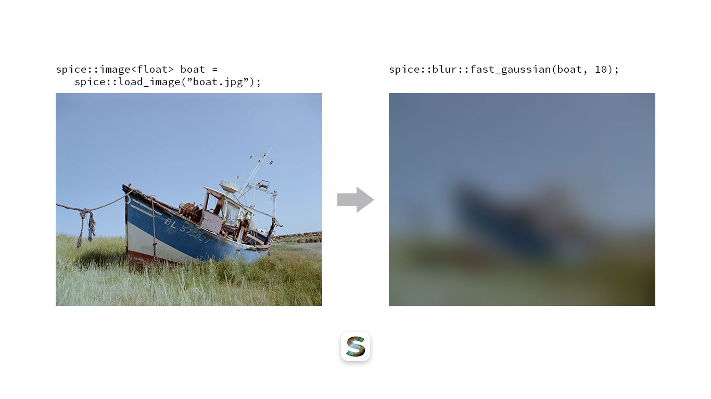

# spice. An image processing library.

[](https://travis-ci.org/JanHett/spice)

This is an attempt to provide a set of generic tools for image processing. At the core of the library is a type for storing n-dimensional data. It intends to translate the flexibility of NumPy's and Julia's Arrays into a low-overhead structure matching the design of the existing C++ standard library.

Building on this type, a number of more image-specific types are provided.

This is also a learning project for me and far from ready for prime-time. Interfaces change frequently, many (all?) things are still inefficient or inconvenient to use and there aren't all that many features yet.

With that being said, here's what spice does do:

## Features

> This section is meant to provide a quick introduction to what can be done with this library. Please refer to the [documentation](https://janhett.github.io/spice/) for more a complete reference and details on the individual types' properties.

### N-Dimensional Container `nd_vector`

Imagine a version of `std::vector` made for storing multidimensional data. Sure, you can nest classic vectors, but each level of nesting will incur an overhead of indirection. The other alternative is to use a single vector and access elements like this: `vec[x + y * line_length]`. Maybe that's fine for 2D structures if you're used to it, but (IMHO) it gets unwieldy and error-prone quickly. Imagine having to index into a three dimensional structure with `vec[x * pixel_size + y * line_length * pixel_size + z]`.

Instead, here's how to create a 3D `nd_vector`:

```c++
spice::nd_vector<float, 3> three_d({100, 200, 100});
```

You can access elements via the subscript operator or the call operator or the `at` member function:

```c++
//                           x   y   z
float element1 = three_d   [42][47][ 0];
float element2 = three_d   (42, 47,  0);
float element2 = three_d.at(42, 47,  0);
```

Note the order of the indices: x, y, and then z. Data in a `spice::nd_vector` is laid out in "column major" order as opposed to the row major order common in C++ and Python. This is to make accessing lower-dimensional slices of the data intuitive and efficient. It also has the nice side effect that loops nested in the  order that might be intuitive to beginners are cache-friendly:

```c++
for (int x = 0; x < three_d.shape[0]; ++x)
  for (int y = 0; y < three_d.shape[1]; ++y)
    for (int z = 0; z < three_d.shape[2]; ++z)
      std::cout << three_d(x, y, z);
```

```
   _________
  /__/__/__/|
 /__/__/__/||
/__/__/__/|||
|__|__|__|||/
|__|__|__||/
|__|__|__|/
^
|
|--------->    ___
              /__/|
             /__/||
            /__/|||
            |__|||/
            |__||/
            |__|/
```


#### A note on the name

I named this structure `nd_vector` because it's closer to a `std::vector` than a `std::array` in that it is a dynamically allocated data structure. I don't love it, though, since vector implies a one-dimensional data structure. Suggestions are welcome.

### View over N-Dimensional slices of `nd_vector`s

Indexing into an `nd_vector` either returns a reference to the stored element (if a full set of coordinates was specified) or a `spice::nd_span` representing a slice of the data.

### [ Future ] Iterators and ranges

Continuously creating and destroying `nd_span` instances is inefficient. To alleviate that, I plan  to implement an iterator type for these multidimensional structures as well as C++20-style ranges.

### Image data structure based on `nd_vector`

Since an image is essentially a three-dimensional array of values (the dimensions being width, height and colour), spice's `image` type is implemented as a subclass of `nd_vector`. It provides a set of additional properties and operations.

### Image processing and analysis tools

#### Blur

##### Fast gaussian blur approximation


Performs a series of box blurs to approximate a true gaussian in linear time. The number of passes is adjustable.

#### Noise

##### Salt and Pepper

##### Uniform

##### Gaussian

#### Statistics

##### Histogram

## Building

spice has been tested to build with clang on macOS. It also requires C++17. I plan on extending support to other operating systems, GCC and eventually MSVC, but for now, features are the primary focus. For these early days, the library will also remain dependent on the most recent C++ standard (read: I will jump up to C++20 as soon as it's ready and if you have standards that require you to stick to a specific C++ version, this library probably fails more than just this test).

spice does not yet have a fully fledged cmake/make setup. Setting this up is part of getting the library to a usable state and will happen before a proper release.

For now, there is a Python build script called `./tools/build`. Please run it with `-h` to find out how to use it, it is changing much too frequently to keep this README up to date.

The main library depends on OpenImageIO, the guideline support library (GSL) and nothing else. For unit testing, Google Test is required and to build the documentation, you need Doxygen and m.css.

## Contributing

If you found this project useful enough to add your two cents (or lines of code), please do!

Here's a few ways you can have a part in driving this library forward:

- use it, note what's working and what isn't and tell me about it
- propose a specific fix or - even better...
- submit a pull request

If you're extremely motivated, here's a list of things I think are in need of attention or review:

- the build system
- the inheritance structure of `image`, `nd_vector` and `nd_span`

## History

This is a re-write of a previous project of mine. It attempts to correct some of the design mistakes I made. That being said, it is far from being usable at the moment. In fact, for now it "does" (almost) nothing for the moment. My current goal is to set up the data structures I need to implement actual functionality. I am taking my time with this, because one of the lessons I learned from the predecessor of this project is that data structures make a huge difference for the performance, reliability and usability of a library. Once this basis is established, I will be sure to boast about the added features in the appropriate place (meaning either in the README or in the documentation).

Check out the [documentation](https://janhett.github.io/spice/) for a more in-depth look at what this library does. I have also published an [article](https://medium.com/@janhettenkofer/designing-an-efficient-user-friendly-image-data-structure-a24a8aed4a2d?source=friends_link&sk=5c8808dfabcf1841752c1fb3e8916238) about the considerations that went into the `spice::image` data structure.

## Credits

Backing image of spice splash screen and favicon: Crab Nebula by NASA/STScI: https://hubblesite.org/contents/media/images/2005/37/1823-Image.html?news=true