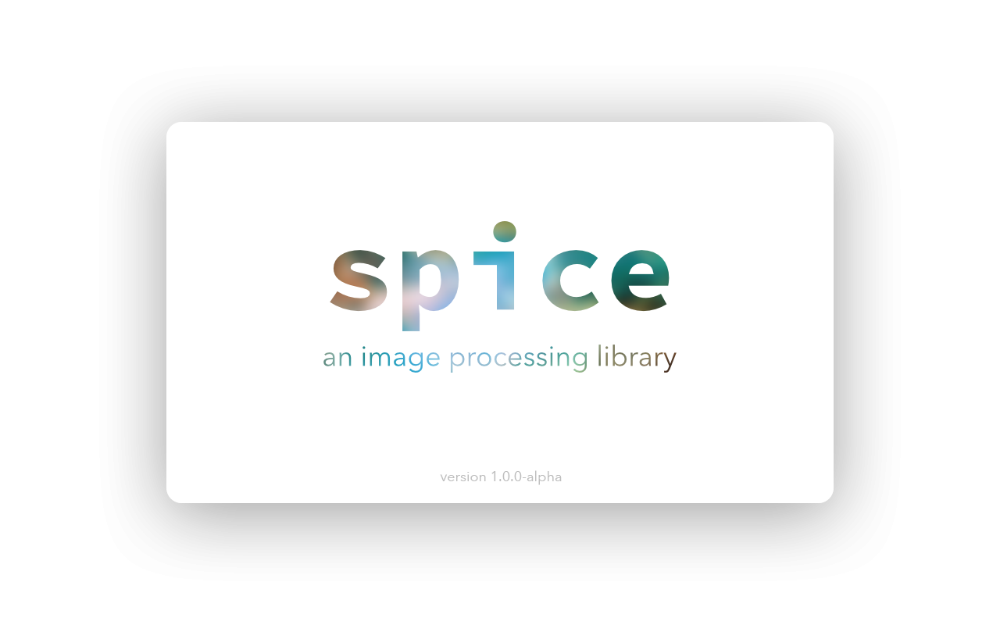
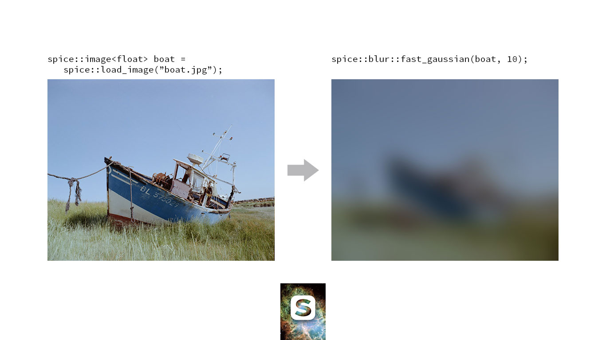
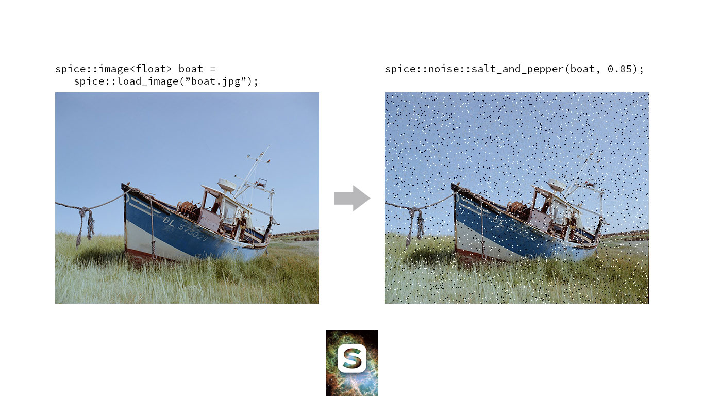
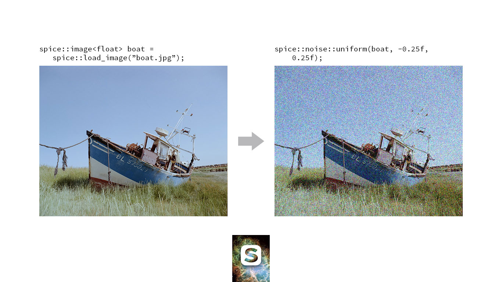
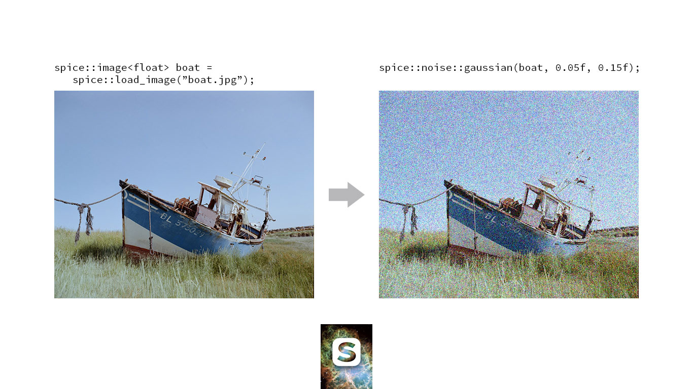
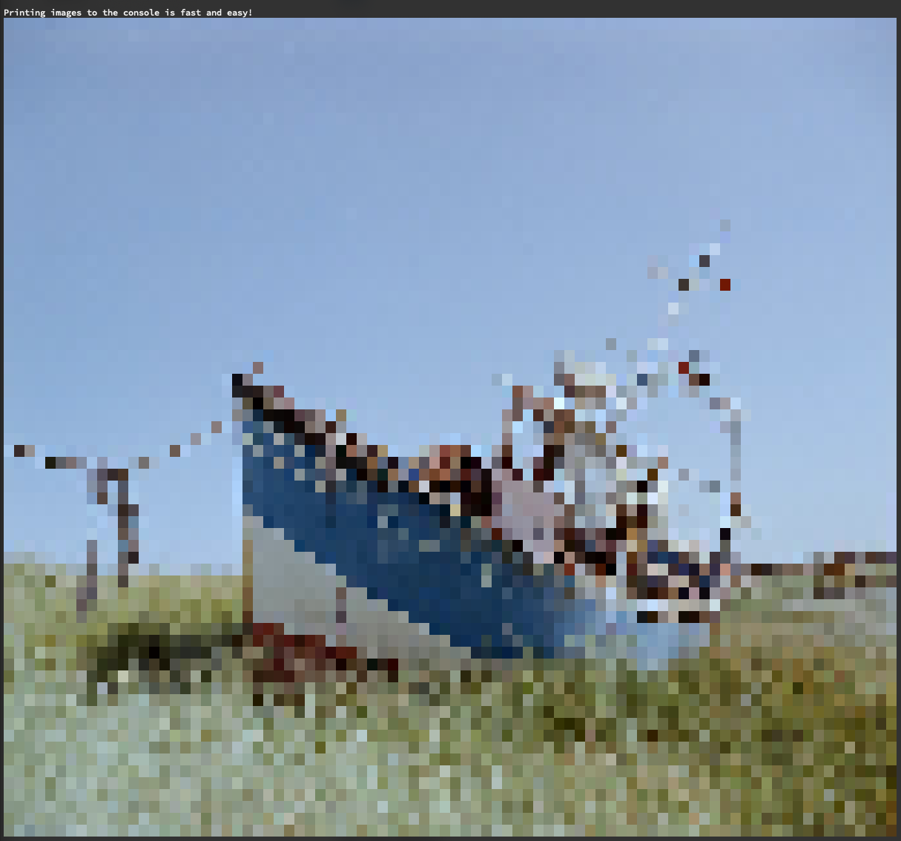

# spice. An image processing library.

 [](https://travis-ci.org/JanHett/spice) [](https://coveralls.io/github/JanHett/spice?branch=master) [](https://www.codacy.com/manual/JanHett/spice?utm_source=github.com&amp;utm_medium=referral&amp;utm_content=JanHett/spice&amp;utm_campaign=Badge_Grade) [](https://github.com/XAMPPRocky/tokei) [](https://bestpractices.coreinfrastructure.org/projects/3262) [](https://www.gnu.org/licenses/gpl-3.0)

This is an attempt to provide a set of generic tools for image processing. At the core of the library is a type for storing n-dimensional data which intends to translate the flexibility of [NumPy's](https://docs.scipy.org/doc/numpy/reference/generated/numpy.array.html) and [Julia's](https://docs.julialang.org/en/v1/manual/arrays/) Arrays into a low-overhead structure imitating the design of the existing C++ standard library (and eventually also being compatible with it where applicable).

Building on this type, a number of more image-specific types are provided.

This is also a learning project for me and far from ready for prime-time. Interfaces change frequently, many (all?) things are still inefficient or inconvenient to use and there aren't all that many features yet.

With that being said, here's what spice does do:

## Features

> This section is meant to provide a quick introduction to what can be done with this library. Please refer to the [documentation](https://janhett.github.io/spice/) for more a complete reference and details on the individual types' properties. The section titles are linked to the appropriate pages.

### N-Dimensional Container [`nd_vector`](https://janhett.github.io/spice/classspice_1_1nd__vector__impl_3_01_dimensions_00_01_t_00_01true_01_4.html)

Imagine a version of `std::vector` made for storing multidimensional data.

#### Motivation

Sure, you can nest classic vectors, but each level of nesting will incur an overhead of indirection. The other alternative is to use a single vector and access elements like this: `vec[x + y * width]`. Maybe that's fine for 2D structures if you're used to it, but (IMHO) it gets unwieldy and error-prone quickly.

With only one additional dimension (for a total of three, i.e. an image), the expression to index into the structure becomes `vec[x * pixel_size + y * width * pixel_size + z]` and with four (e.g. frame number, width, heigh, colour) this style produces this mad, 87 characters long expression: `vec[frame * width * height * pixel_size + x * pixel_size + y * width * pixel_size + z]`.

#### Basic Usage

Here's how to create a 3D `nd_vector` with spice:

```c++
spice::nd_vector<float, 3> three_d({100, 200, 100});
```

You can access elements via the subscript operator, the call operator or the `at` member function (use the latter to get bounds checking):

```c++
//                           x   y   z
float element1 = three_d   [42][47][ 0];
float element2 = three_d   (42, 47,  0);
float element2 = three_d.at(42, 47,  0);
```

#### Data Layout

Note the order of the indices in the above snippet: x, y, and then z. Data in a `spice::nd_vector` is laid out in "column major" order as opposed to the row major order common in C++ and Python. This is to make accessing lower-dimensional slices of the data intuitive and efficient. It also has the nice side effect that loops nested in the  order that might be intuitive to beginners are cache-friendly:

```c++
for (int x = 0; x < three_d.shape[0]; ++x)
  for (int y = 0; y < three_d.shape[1]; ++y)
    for (int z = 0; z < three_d.shape[2]; ++z)
      std::cout << three_d(x, y, z);
```

#### Inheritance structure

Note that `nd_vector` is implemented as a non-virtual subclass of `nd_span` to avoid re-implementation of comment functionality. Since the inheritance is non-virtual, though, an `nd_span` cannot safely be substituted with an `nd_vector`. Use a template if you want to be able to use either. Once C++20 concepts are available in the major compilers' binary releases, I'll add the appropriate concepts to the library.

#### A note on the name

I named this structure `nd_vector` because it's closer to a `std::vector` than a `std::array` in that it is a dynamically allocated data structure. However, since the term *vector* implies a one-dimensional data structure I would very much like to replace it with something more appropriate. Suggestions are welcome.

### View over N-Dimensional slices of `nd_vector`s: [`nd_span`](https://janhett.github.io/spice/classspice_1_1nd__vector__impl.html)

Indexing into an `nd_vector` either returns a reference to the stored element (if a full set of coordinates was specified) or a `spice::nd_span` representing a slice of the data.

In beautiful ASCII art, the functioning of a three dimensional `nd_vector<T, 3>`'s `operator[]` might be visualised like this:

```
   _________
  /__/__/__/|
 /__/__/__/||
/__/__/__/|||
|__|__|__|||/
|__|__|__||/
|__|__|__|/
 │      ___
 └───> /__/|
      /__/||       ___
     /__/|||      /__/|
     |__|||/     /__/|/      __
     |__||/     /__/|/     /__/|
     |__|/ ───> |__|/ ───> |__|/
```

The first invokation returns a two dimensional `nd_span<T, 2>`, the second a one dimensional `nd_span<T, 1>` and the last returns a `T&`, a reference to the actual element.

### [ Future ] Iterators and ranges

Continuously creating and destroying `nd_span` instances is inefficient. To alleviate that, I plan  to implement an iterator type for these multidimensional structures as well as C++20-style ranges.

### [`image`](https://janhett.github.io/spice/classspice_1_1image.html) type, based on `nd_vector`

Since an image is essentially a three-dimensional array of values (the dimensions being width, height and colour channels), spice's `image` type is implemented as a subclass of `nd_vector`. It provides additional, image-specific properties and operations such as a `constexpr static` member variable indicating the values representing unexposed or fully saturated pixels (`image<T>::range.min` and `image<T>::range.max`).

Same as `nd_vector` extending `nd_span`, `image` is also a non-virtual subclass of `nd_vector`.

### Image processing and analysis tools

#### [Compositing](https://janhett.github.io/spice/composite_8hpp.html)

##### Merge images

spice provides the function template `merge` to combine two images.

```c++
image<float> foreground, background;

// create images or load from files...

// create a transformation object
transform_2d tx = scale(1, 1.9).rotate(2.3).translate(42, 47);
// transform `foreground` by `tx` and superimpose it on `background`
merge<float>(background, foreground, tx);
```

It is parametrised with:

- `T`, the data type of the images to merge
- `Interpolation` the interpolation function to use
- `BlendFunction` the blend function to use

A number of interpolation and blend functions are provided.

###### [Interpolation functions](https://janhett.github.io/spice/namespacespice_1_1interpolation.html)

Interpolation functions are types with a call operator taking the coordinates to interpolate as two `float` arguments. They are scoped under the namespace `spice::interpolation`.

| Function name             | Description                                                  |
| ------------------------- | ------------------------------------------------------------ |
| `nearest_neighbour`       | Returns the value to the top-left of the provided coordinate (i.e. "floors" the coordinates) |
| `nearest_neighbour_round` | Returns the value of the pixel closest to the input position (i.e. rounding the coordinates) |
| `bilinear`                | Estimates the value at the provided coordinates using [bilinear interpolation](https://en.wikipedia.org/wiki/Bilinear_interpolation). |

All interpolation functions return a zero-initialised colour as their default (i.e. when trying to access a value outside the image boundaries)

###### [Blend functions](https://janhett.github.io/spice/namespacespice_1_1blend__function.html)

Blend functions are types with a call operator taking the colours to blend as `pixel_view` arguments. They are scoped under the namespace `spice::blend_function`.

| Function name | Description                                                  |
| ------------- | ------------------------------------------------------------ |
| `overlay`     | Calculates the resulting colour respecting the opacities of the two operands. For the moment, this  operations assumes premultiplied alpha. |

###### [Transformation](https://janhett.github.io/spice/classspice_1_1transform__2d.html)

To position an image spice provides the `transform_2d` type. It exposes a set of convenience functions around a 4x4 transformation matrix.

A transformation matrix can be created and modified in one of several ways:

```c++
// The default constructor creates a neutral transformation matrix
transform_2d tx0;
// Using chainable syntax, this matrix can be modified
tx0.scale(0.52, 1).rotate(90);
// Free functions of the appropriate names are also provided that create a pre-initialised matrix.
transform_2d tx1 = scale(1, 1.9).rotate(2.3).translate(42, 47);
// Finally, a fully specified matrix can be created
transform_2d tx2(
  42, 47, // translate
  45,     // rotate
  1, 1    // scale
);
```

#### [Blur](https://janhett.github.io/spice/namespacespice_1_1blur.html)

##### Fast gaussian blur approximation


Performs a series of box blurs to approximate a true gaussian in linear time. The number of passes is adjustable.

#### [Noise](https://janhett.github.io/spice/namespacespice_1_1noise.html)

##### Salt and Pepper



Adds salt-and-pepper noise with a given density to the image passed as the first argument.

##### Uniform



Adds noise, uniformly distributed between the specified minimum and maximum values, to the image. The default combining operation is addition but other operations can be specified if needed.

##### Gaussian



Adds gaussian noise with a given median value and standard deviation to the image. The default combining operation is addition but other operations can be specified if needed.

#### [Statistics](https://janhett.github.io/spice/namespacespice_1_1statistics.html)

##### Histogram

Calculates a histogram of the provided image. Since floating point images are pseudo-continuous and often the full precision of integer types is not needed in a histogram, the `samples` argument specifies the number of "buckets" image values are to be sorted into.

#### [Debugging/Printing Tools](https://janhett.github.io/spice/namespacespice_1_1print.html)

##### Printing images to out-streams

On terminals that can display full 8bpc colour, the `spice::print::image(image<T> img, size_t stride, std::ostream& os)` function will print an approximation of the image to the provided stream using RGB colour escape codes to display the image.



Not glamorous, but for retro-cool and debugging it does the job.

##### Printing histograms to out-streams

> Note: this function is currently broken.

Analogous to images, histograms can also be printed to any arbitrary stream.

## Building

### Prerequisites

#### For the library

- [C++17](https://en.cppreference.com/w/cpp/compiler_support)
- [CMake 3.10](https://cmake.org/)
- [OpenImageIO](https://github.com/OpenImageIO/oiio)
- [Guideline Support Library](https://github.com/microsoft/GSL) (included as a git submodule, will be pulled by CMake during configuration)

#### For the tests

- [Google Test](https://github.com/google/googletest)

#### For the documentation

- [Doxygen](http://www.doxygen.nl/)
- [m.css](https://github.com/mosra/m.css) (included as a git submodule, will be pulled by CMake during configuration if building documentation is enabled)

### Build It!

```bash
cd <spice repo directory>
mkdir build
cd build
# tests are enabled by default, use option ENABLE_TESTS to override
cmake .. -DCMAKE_INSTALL_PREFIX=<where spice should be installed> [-DENABLE_TESTS=OFF|ON] [-DENABLE_DOCS=OFF|ON]
cmake --build . --config Debug|Release [--target [install] [doc]]
# if you chose to build the tests, you can test if everything worked
tests/spice-test
```

### Notes

spice has been tested to build with clang on macOS and may or may not build in other configurations. I plan to extend support to other operating systems and platforms, but for now, features are the primary focus. For these early days, the library will also remain dependent on the most recent C++ standard (read: I will jump up to C++20 as soon as it's ready and if you have standards that require you to stick to a specific C++ version, this library probably fails more than just this test).

## Contributing

If you found this project useful enough to add your two cents (or lines of code), please do!

Here's a few ways you can have a part in driving this library forward:

- use it, note what's working and what isn't and tell me about it
- review the code
- propose a specific fix or - even better...
- submit a pull request

If you submit a pull request, make sure all added functionality is thoroughly (unit) tested.

If you spot a bug or a vulnerability, please [create an issue](https://github.com/JanHett/spice/issues/new) describing the malfunction. I will do my best to look into it within a few days.

## History

This is the third iteration of a "learning-by-failing-and-starting-over" project of mine. The idea is to build an understanding for image processing by building this library from the ground up.

In the process of writing spice as it exists today, I have also published an [article](https://medium.com/@janhettenkofer/designing-an-efficient-user-friendly-image-data-structure-a24a8aed4a2d?source=friends_link&sk=5c8808dfabcf1841752c1fb3e8916238) about the considerations that went into the `spice::image` data structure (an earlier version of it).

## Credits

The build system has been adapted from cmake init: https://github.com/cginternals/cmake-init

Backing image of spice splash screen and favicon: Crab Nebula by NASA/STScI: https://hubblesite.org/contents/media/images/2005/37/1823-Image.html?news=true