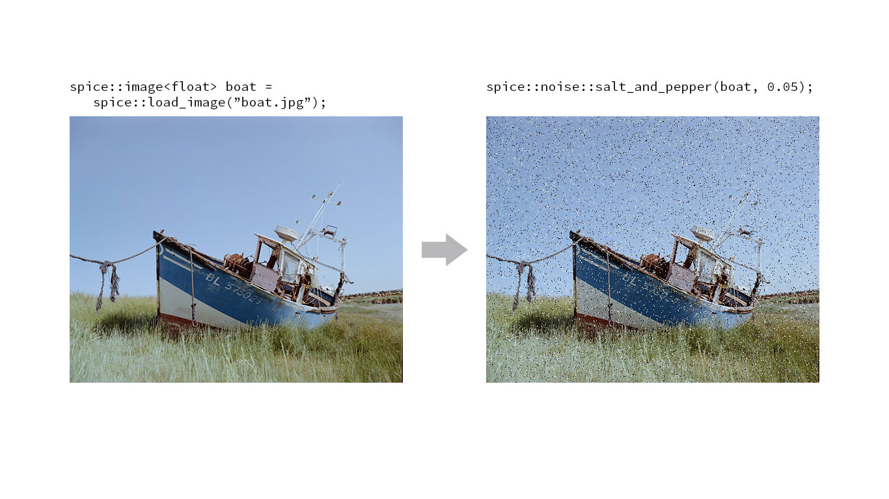
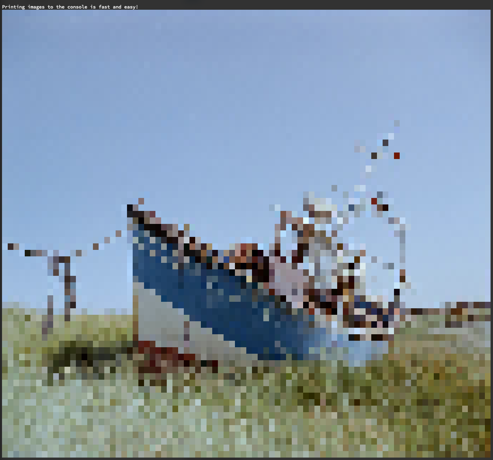

# spice. An image processing library.

[](https://travis-ci.org/JanHett/spice)
[](https://app.fossa.io/projects/git%2Bgithub.com%2FJanHett%2Fspice?ref=badge_shield)

This is an attempt to provide a set of generic tools for image processing. At the core of the library is a type for storing n-dimensional data. It intends to translate the flexibility of [NumPy's](https://docs.scipy.org/doc/numpy/reference/generated/numpy.array.html) and [Julia's](https://docs.julialang.org/en/v1/manual/arrays/) Arrays into a low-overhead structure imitating the design of the existing C++ standard library.

Building on this type, a number of more image-specific types are provided.

This is also a learning project for me and far from ready for prime-time. Interfaces change frequently, many (all?) things are still inefficient or inconvenient to use and there aren't all that many features yet.

With that being said, here's what spice does do:

## Features

> This section is meant to provide a quick introduction to what can be done with this library. Please refer to the [documentation](https://janhett.github.io/spice/) for more a complete reference and details on the individual types' properties.

### N-Dimensional Container `nd_vector`

Imagine a version of `std::vector` made for storing multidimensional data. Sure, you can nest classic vectors, but each level of nesting will incur an overhead of indirection. The other alternative is to use a single vector and access elements like this: `vec[x + y * line_length]`. Maybe that's fine for 2D structures if you're used to it, but (IMHO) it gets unwieldy and error-prone quickly. Imagine having to index into a three dimensional structure with `vec[x * pixel_size + y * line_length * pixel_size + z]`.

Instead, here's how to create a 3D `nd_vector`:

```c++
spice::nd_vector<float, 3> three_d({100, 200, 100});
```

You can access elements via the subscript operator, the call operator or the `at` member function:

```c++
//                           x   y   z
float element1 = three_d   [42][47][ 0];
float element2 = three_d   (42, 47,  0);
float element2 = three_d.at(42, 47,  0);
```

Note the order of the indices: x, y, and then z. Data in a `spice::nd_vector` is laid out in "column major" order as opposed to the row major order common in C++ and Python. This is to make accessing lower-dimensional slices of the data intuitive and efficient. It also has the nice side effect that loops nested in the  order that might be intuitive to beginners are cache-friendly:

```c++
for (int x = 0; x < three_d.shape[0]; ++x)
  for (int y = 0; y < three_d.shape[1]; ++y)
    for (int z = 0; z < three_d.shape[2]; ++z)
      std::cout << three_d(x, y, z);
```

#### A note on the name

I named this structure `nd_vector` because it's closer to a `std::vector` than a `std::array` in that it is a dynamically allocated data structure. I don't love it, though, since vector implies a one-dimensional data structure. Suggestions are welcome.

### View over N-Dimensional slices of `nd_vector`s

Indexing into an `nd_vector` either returns a reference to the stored element (if a full set of coordinates was specified) or a `spice::nd_span` representing a slice of the data.

In beautiful ASCII art, the functioning of a three dimensional `nd_vector<T, 3>`'s `operator[]` might be visualised like this:

```
   _________
  /__/__/__/|
 /__/__/__/||
/__/__/__/|||
|__|__|__|||/
|__|__|__||/
|__|__|__|/
 │      ___
 └───> /__/|
      /__/||       ___
     /__/|||      /__/|
     |__|||/     /__/|/      __
     |__||/     /__/|/     /__/|
     |__|/ ───> |__|/ ───> |__|/
```

The first invokation returns a two dimensional `nd_span<T, 2>`, the second a one dimensional `nd_span<T, 1>` and the last returns a `T&`, a reference to the actual element.

### [ Future ] Iterators and ranges

Continuously creating and destroying `nd_span` instances is inefficient. To alleviate that, I plan  to implement an iterator type for these multidimensional structures as well as C++20-style ranges.

### Image data structure based on `nd_vector`

Since an image is essentially a three-dimensional array of values (the dimensions being width, height and colour), spice's `image` type is implemented as a subclass of `nd_vector`. It provides a set of additional properties and operations.

### Image processing and analysis tools

#### [Blur](https://janhett.github.io/spice/namespacespice_1_1blur.html)

##### Fast gaussian blur approximation


Performs a series of box blurs to approximate a true gaussian in linear time. The number of passes is adjustable.

#### [Noise](https://janhett.github.io/spice/namespacespice_1_1noise.html)

##### Salt and Pepper



Adds salt-and-pepper noise with a given density to the image passed as the first argument.

##### Uniform

> Not yet implemented

##### Gaussian

> Not yet implemented

#### [Statistics](https://janhett.github.io/spice/namespacespice_1_1statistics.html)

##### Histogram

Calculates a histogram of the provided image. Since floating point images are pseudo-continuous and often the full precision of integer types is not needed in a histogram, the `samples` argument specifies the number of "buckets" image values are to be sorted into.

#### [Debugging/Printing Tools](https://janhett.github.io/spice/namespacespice_1_1print.html)

##### Printing images to out-streams

On terminals that can display full 8bpc colour, the `spice::print::image(image<T> img, size_t stride, std::ostream& os)` function will print an approximation of the image to the provided stream using RGB colour escape codes to display the image.



Not glamorous, but for retro-cool and debugging it does the job.

##### Printing histograms to out-streams

> Note: this function is currently broken.

Analogous to images, histograms can also be printed to any arbitrary stream.

## Building

In a nutshell:

```bash
python3 tools/build.py <Debug | Release>
```

### Prerequisites

#### For the library

- C++17
- [CMake 3.10](https://cmake.org/)
- [OpenImageIO](https://github.com/OpenImageIO/oiio)
- [Guideline Support Library](https://github.com/microsoft/GSL) (available as a git submodule, will be pulled by CMake during configuration)
- [Google Test](https://github.com/google/googletest) (technically only needed for building tests)

#### For the documentation

- [Doxygen](http://www.doxygen.nl/)
- [m.css](https://github.com/mosra/m.css) (available as a git submodule, pull with `git submodule update --recursive --remote --init`)

### Notes

spice does not yet have a fully fledged cmake/make setup. Setting this up is part of getting the library to a usable state and will happen before a proper release.

For now, there is a Python build script called `./tools/build`. Run it with `-h` for details on how to use it.

spice has been tested to build with clang and gcc on macOS and may or may not build in other configurations. I plan to extend support to other operating systems and eventually also the MSVC platform, but for now, features are the primary focus. For these early days, the library will also remain dependent on the most recent C++ standard (read: I will jump up to C++20 as soon as it's ready and if you have standards that require you to stick to a specific C++ version, this library probably fails more than just this test).

## Contributing

If you found this project useful enough to add your two cents (or lines of code), please do!

Here's a few ways you can have a part in driving this library forward:

- use it, note what's working and what isn't and tell me about it
- propose a specific fix or - even better...
- submit a pull request

If you're extremely motivated, here's a list of things I think are in need of attention or review:

- the build system
- the inheritance structure of `image`, `nd_vector` and `nd_span`

## History

This is the third iteration of a "learning-by-failing-and-starting-over" project of mine. The idea is to build an understanding for image processing by building this library from the ground up.

In the process of writing spice as it exists today, I have also published an [article](https://medium.com/@janhettenkofer/designing-an-efficient-user-friendly-image-data-structure-a24a8aed4a2d?source=friends_link&sk=5c8808dfabcf1841752c1fb3e8916238) about the considerations that went into the `spice::image` data structure (an earlier version of it).

## Credits

Backing image of spice splash screen and favicon: Crab Nebula by NASA/STScI: https://hubblesite.org/contents/media/images/2005/37/1823-Image.html?news=true

## License
[](https://app.fossa.io/projects/git%2Bgithub.com%2FJanHett%2Fspice?ref=badge_large)